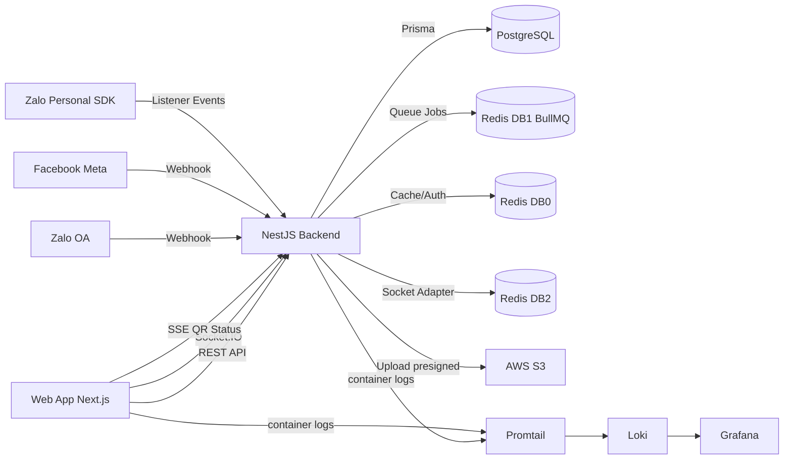

# Kiến Trúc Hệ Thống

## Tổng quan kiến trúc

Comitor dùng kiến trúc tách lớp theo domain, kết hợp request/response đồng bộ và event-driven bất đồng bộ.

## Thành phần backend

- `AppModule`: compose toàn bộ domain module.
- `core/*`: nghiệp vụ nội bộ (users, roles, permissions, conversations, messages, profiles...).
- `platform/*`: tích hợp bên thứ 3 (Zalo OA, Zalo personal, Meta, webhook, sender/fetcher registry).
- `queue/*`: BullMQ worker xử lý message inbound.
- `websocket/*`: gateway realtime + Redis adapter.
- `common/*`: guard, filter, interceptor, decorator dùng chung.

## Thành phần frontend

- Next.js App Router với 2 vùng route: `(auth)` và `(user)`.
- `React Query` cho fetch/cache/invalidation.
- `Zustand` cho auth state và chat store.
- Socket handlers tách riêng theo event nhóm `conversation` và `message`.

## Shared package

- `@workspace/database`:
- Prisma schema tập trung.
- generated client và export type.
- constants permission dùng chung FE/BE.

## Luồng dữ liệu chính

1. Synchronous: FE -> API -> DB -> FE.
2. Asynchronous: Platform webhook/listener -> queue -> DB -> socket broadcast -> FE realtime.
