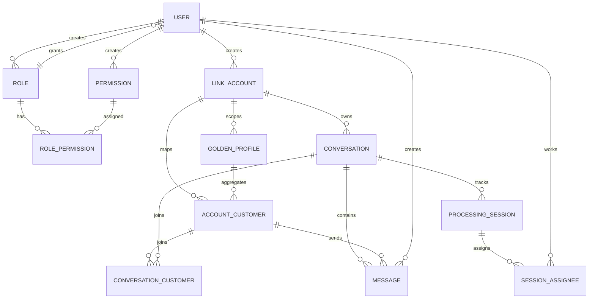

# Thiết Kế Database

## Công nghệ

- PostgreSQL
- Prisma schema tập trung tại `packages/database/prisma/schema/*`
- Generated Prisma client dùng chung cho backend + type sharing

## Nhóm bảng chính

1. Identity & Access

- `user`
- `roles`
- `permissions`
- `role_permissions`
- `refresh_tokens`

2. Omni-channel mapping

- `link_accounts`
- `account_customer`
- `golden_profiles`
- `conversation_customers`

3. Conversation workspace

- `conversations`
- `messages`
- `conversation_processing_sessions`
- `conversation_session_assignees`

4. Supporting domain

- `agent_levels`
- `suggested_messages`

## ERD mức nghiệp vụ

## Unique/index quan trọng

- `link_accounts`: unique `(accountId, provider)`.
- `conversations`: unique `(linkedAccountId, externalId)`.
- `account_customer`: unique `(accountId, linkedAccountId)`.
- `role_permissions`: unique `(roleId, permissionId)`.
- `messages`: index `(conversationId, timestamp desc, id desc)` để phân trang message.

## Chuẩn dữ liệu

- Enum nghiệp vụ: `ChannelType`, `MessageType`, `ConversationType`, `LinkAccountStatus`, ...
- Soft-delete flag `isDeleted` xuất hiện ở nhiều bảng domain.
- Các trường thời gian chuẩn hóa `createdAt`, `updatedAt`.

## Seed mặc định

Seed script khởi tạo:

- user `systemadmin`
- role `system`
- toàn bộ permission từ constants
- gán full permission cho role system
