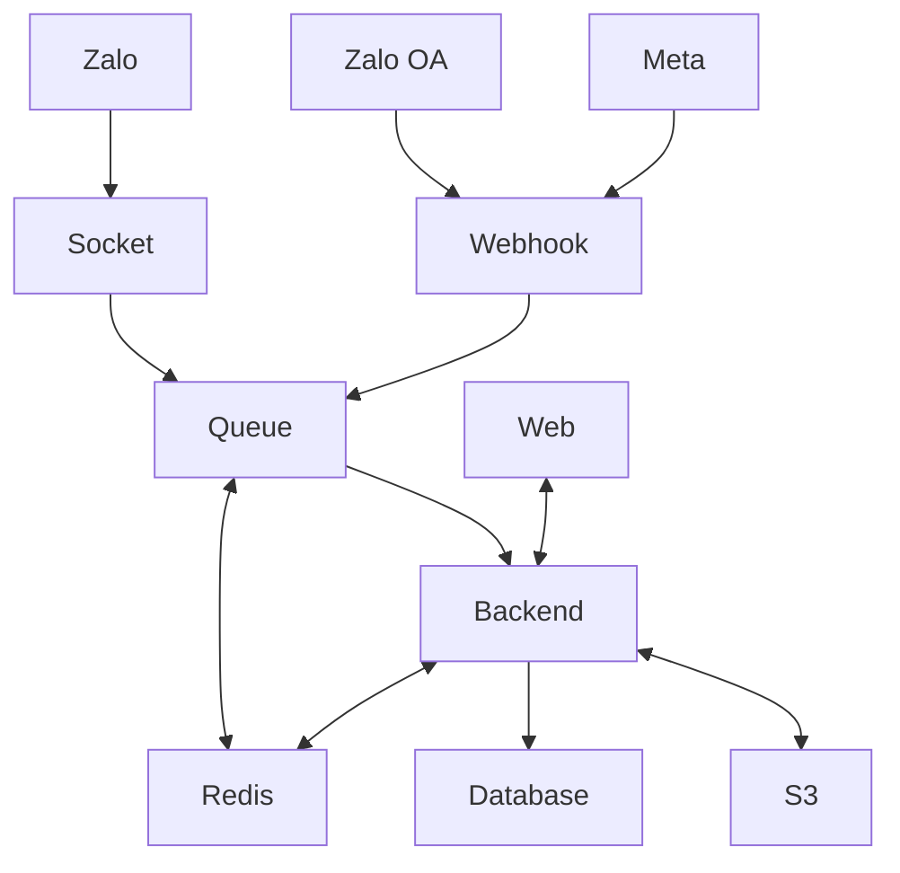
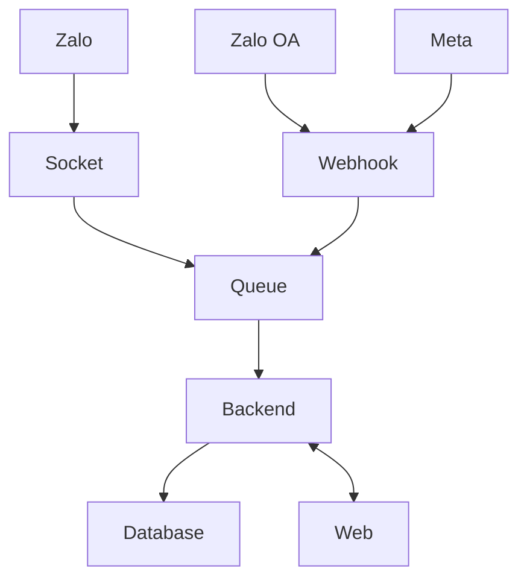
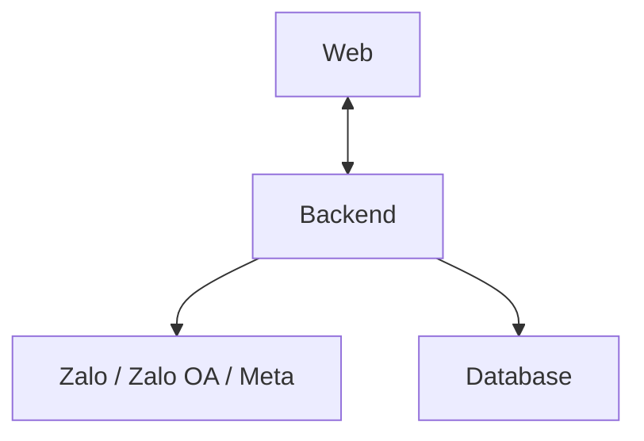

# Kiến trúc hệ thống

Mục tiêu: đưa toàn bộ xử lý khách hàng đa nền tảng về một nơi để quản lý, phân công và theo dõi tập trung.

## 1) Sơ đồ tổng thể (đơn giản, từ trên xuống)

## 2) Ý nghĩa từng cụm

- **Zalo / Zalo OA / Meta**: các nguồn tương tác khách hàng.
- **Webhook**: nhận dữ liệu từ Zalo OA và Meta.
- **Socket**: nhận dữ liệu từ Zalo.
- **Queue**: tầng hàng đợi riêng để gom và điều phối xử lý.
- **Backend**: xử lý nghiệp vụ tập trung.
- **Redis**: tầng trung gian hỗ trợ hàng đợi và xử lý ổn định.
- **Database**: nơi lưu dữ liệu tập trung.
- **S3**: nơi lưu trữ ảnh/tệp.
- **Web**: nơi đội vận hành thao tác và theo dõi realtime.

## 3) Luồng chính

### 3.1 Luồng vào (inbound)

### 3.2 Luồng ra (outbound)

