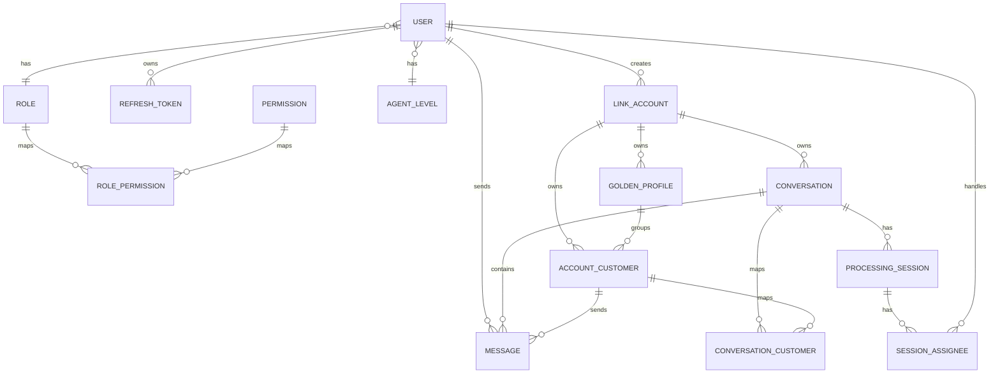

# Thiết kế Database

## 1) Phạm vi

Tài liệu mô tả chi tiết thiết kế dữ liệu hiện tại của dự án Comitor theo schema Prisma tại `packages/database/prisma/schema/*.prisma`.

## 2) Quy ước đọc

- **PK**: khóa chính
- **FK**: khóa ngoại
- **UQ**: unique
- **IDX**: index
- **NN**: not null
- **NULL**: cho phép null

---

## 3) Nhóm bảng Quản trị nội bộ

### 3.1 Bảng `user`

**Mục đích**: lưu tài khoản người dùng nội bộ (admin/supervisor/agent).

| Field | Type | Null | Default | Ràng buộc | Ghi chú |
|---|---|---|---|---|---|
| id | String | NN | uuid() | PK | ID người dùng |
| name | String | NN |  |  | Họ tên |
| email | String | NN |  | UQ | Email đăng nhập |
| username | String | NN |  | UQ | Tên đăng nhập |
| password | String | NN |  |  | Mật khẩu băm |
| email_verified | Boolean | NN | false |  | Trạng thái xác thực email |
| avatar_url | String | NULL |  |  | Ảnh đại diện |
| phone | String | NULL |  | UQ | SĐT |
| role_id | String | NULL |  | FK -> roles.id | Vai trò |
| agent_level_id | String | NULL |  | FK -> agent_levels.id | Cấp độ agent |
| is_active | Boolean | NN | true |  | Trạng thái hoạt động |
| is_online | Boolean | NN | false |  | Trạng thái online |
| count_processing_sessions | Int | NN | 0 |  | Số phiên đang xử lý |
| is_ready_processing | Boolean | NN | true |  | Sẵn sàng xử lý |
| created_by_id | String | NN |  | FK -> user.id | Người tạo |
| is_deleted | Boolean | NN | false |  | Soft delete |
| created_at | DateTime | NN | now() |  | Thời gian tạo |
| updated_at | DateTime | NN | updatedAt |  | Thời gian cập nhật |

**Quan hệ chính**:
- `user.role_id` -> `roles.id` (n-1)
- self relation: `created_by_id` -> `user.id`
- 1-n với `refresh_tokens`, `link_accounts`, `messages(created_by_id)`...

---

### 3.2 Bảng `roles`

**Mục đích**: định nghĩa vai trò hệ thống.

| Field | Type | Null | Default | Ràng buộc | Ghi chú |
|---|---|---|---|---|---|
| id | String | NN | uuid() | PK | ID role |
| name | String | NN |  | UQ | Tên role |
| description | String | NULL |  |  | Mô tả |
| created_by_id | String | NN |  | FK -> user.id | Người tạo |
| is_deleted | Boolean | NN | false |  | Soft delete |
| created_at | DateTime | NN | now() |  |  |
| updated_at | DateTime | NN | updatedAt |  |  |

---

### 3.3 Bảng `permissions`

**Mục đích**: định nghĩa quyền thao tác.

| Field | Type | Null | Default | Ràng buộc | Ghi chú |
|---|---|---|---|---|---|
| id | String | NN | uuid() | PK | ID permission |
| code | String | NN |  | UQ | Mã quyền |
| description | String | NULL |  |  | Mô tả |
| created_by_id | String | NN |  | FK -> user.id | Người tạo |
| is_deleted | Boolean | NN | false |  | Soft delete |
| created_at | DateTime | NN | now() |  |  |
| updated_at | DateTime | NN | updatedAt |  |  |

---

### 3.4 Bảng `role_permissions`

**Mục đích**: bảng nối many-to-many giữa role và permission.

| Field | Type | Null | Default | Ràng buộc | Ghi chú |
|---|---|---|---|---|---|
| role_id | String | NN |  | FK -> roles.id |  |
| permission_id | String | NN |  | FK -> permissions.id |  |

**Khóa/ràng buộc**:
- UQ composite: `(role_id, permission_id)`

---

### 3.5 Bảng `refresh_tokens`

**Mục đích**: lưu refresh token đăng nhập.

| Field | Type | Null | Default | Ràng buộc | Ghi chú |
|---|---|---|---|---|---|
| user_id | String | NN |  | FK -> user.id | Người sở hữu token |
| hashToken | String | NN |  | UQ | Token hash |
| expires_at | DateTime | NN |  |  | Hạn dùng |
| created_at | DateTime | NN | now() |  |  |
| updated_at | DateTime | NN | updatedAt |  |  |

---

### 3.6 Bảng `agent_levels`

**Mục đích**: cấu hình cấp độ và năng lực xử lý agent.

| Field | Type | Null | Default | Ràng buộc | Ghi chú |
|---|---|---|---|---|---|
| id | String | NN | uuid() | PK |  |
| code | String | NN |  | UQ | Mã cấp độ |
| description | String | NN |  |  | Mô tả |
| years_of_experience | Int | NN |  |  | Số năm kinh nghiệm |
| max_concurrent_conversations | Int | NN |  |  | Số hội thoại tối đa |
| created_by_id | String | NN |  | FK -> user.id | Người tạo |
| is_deleted | Boolean | NN | false |  | Soft delete |
| created_at | DateTime | NN | now() |  |  |
| updated_at | DateTime | NN | updatedAt |  |  |

---

### 3.7 Bảng `suggested_messages`

**Mục đích**: lưu mẫu nội dung trả lời gợi ý.

| Field | Type | Null | Default | Ràng buộc | Ghi chú |
|---|---|---|---|---|---|
| id | String | NN | uuid() | PK |  |
| tag | String | NN |  | IDX(tag) | Nhóm mẫu |
| message | String | NN |  |  | Nội dung |
| images | `String[]` | NN |  |  | Danh sách ảnh |
| created_by_id | String | NN |  | FK -> user.id | Người tạo |
| is_deleted | Boolean | NN | false |  | Soft delete |
| created_at | DateTime | NN | now() |  |  |
| updated_at | DateTime | NN | updatedAt |  |  |

---

## 4) Nhóm bảng Tích hợp nền tảng

### 4.1 Bảng `link_accounts`

**Mục đích**: lưu tài khoản kết nối theo từng nền tảng (zalo, zalo oa, facebook).

| Field | Type | Null | Default | Ràng buộc | Ghi chú |
|---|---|---|---|---|---|
| id | String | NN | uuid() | PK |  |
| provider | ChannelType | NN |  |  | Nền tảng |
| display_name | String | NULL |  |  | Tên hiển thị |
| account_id | String | NULL |  |  | ID tài khoản nền tảng |
| avatar_url | String | NULL |  |  | Ảnh đại diện |
| status | LinkAccountStatus | NN | active |  | active/inactive |
| credentials | Json | NN |  |  | Token/credential |
| created_by_id | String | NN |  | FK -> user.id | Người tạo |
| is_deleted | Boolean | NN | false |  | Soft delete |
| created_at | DateTime | NN | now() |  |  |
| updated_at | DateTime | NN | updatedAt |  |  |

**Khóa/ràng buộc**:
- UQ composite: `(account_id, provider)`

---

## 5) Nhóm bảng Hồ sơ khách hàng

### 5.1 Bảng `golden_profiles`

**Mục đích**: hồ sơ khách hàng hợp nhất (golden profile).

| Field | Type | Null | Default | Ràng buộc | Ghi chú |
|---|---|---|---|---|---|
| id | String | NN | uuid() | PK |  |
| linked_account_id | String | NN |  | FK -> link_accounts.id | Tài khoản liên kết |
| full_name | String | NULL |  |  | Họ tên |
| gender | Gender | NULL |  |  | Giới tính |
| date_of_birth | Date | NULL |  |  | Ngày sinh |
| primary_phone | String | NULL |  |  | SĐT chính |
| primary_email | String | NULL |  |  | Email chính |
| address | String | NULL |  |  | Địa chỉ |
| city | String | NULL |  |  | Thành phố |
| member_tier | MemberTier | NULL |  |  | Hạng thành viên |
| loyalty_points | Int | NN | 0 |  | Điểm tích lũy |
| customer_type | CustomerType | NN | individual |  | Loại khách |
| elines_customer_id | String | NULL |  |  | ID hệ ngoài |
| is_blacklisted | Boolean | NN | false |  | Cờ chặn |
| journey_state | JourneyState | NULL |  |  | Trạng thái hành trình |
| characteristics | String | NULL |  |  | Đặc điểm |
| staff_notes | String | NULL |  |  | Ghi chú nội bộ |
| is_deleted | Boolean | NN | false |  | Soft delete |
| created_at | DateTime | NN | now() |  |  |
| updated_at | DateTime | NN | updatedAt |  |  |

**Khóa/ràng buộc**:
- UQ composite: `(full_name, primary_phone, primary_email)`

---

### 5.2 Bảng `account_customer`

**Mục đích**: tài khoản khách hàng theo từng nền tảng, ánh xạ về golden profile.

| Field | Type | Null | Default | Ràng buộc | Ghi chú |
|---|---|---|---|---|---|
| id | String | NN | uuid() | PK |  |
| account_id | String | NN |  |  | ID khách trên nền tảng |
| linked_account_id | String | NN |  | FK -> link_accounts.id | Thuộc tài khoản liên kết nào |
| name | String | NN |  |  | Tên hiển thị |
| golden_profile_id | String | NN |  | FK -> golden_profiles.id | Hồ sơ hợp nhất |
| avatar_url | String | NULL |  |  | Ảnh đại diện |
| is_active | Boolean | NN | true |  | Trạng thái |
| last_activity_at | DateTime | NN |  |  | Hoạt động gần nhất |
| is_deleted | Boolean | NN | false |  | Soft delete |
| created_at | DateTime | NN | now() |  |  |
| updated_at | DateTime | NN | updatedAt |  |  |

**Khóa/ràng buộc**:
- UQ composite: `(account_id, linked_account_id)`

---

## 6) Nhóm bảng Hội thoại & Tin nhắn

### 6.1 Bảng `conversations`

**Mục đích**: bản ghi hội thoại trung tâm.

| Field | Type | Null | Default | Ràng buộc | Ghi chú |
|---|---|---|---|---|---|
| id | String | NN | uuid() | PK |  |
| linked_account_id | String | NN |  | FK -> link_accounts.id, IDX |  |
| name | String | NN |  |  | Tên hội thoại |
| avatar_url | String | NULL |  |  | Ảnh hội thoại |
| external_id | String | NULL |  | UQ(linked_account_id, external_id) | ID ngoài |
| type | ConversationType | NN | personal |  | personal/group |
| tag | ConversationTag | NN | other |  | Nhãn hội thoại |
| journey_state | JourneyState | NULL |  |  | Trạng thái hành trình |
| status | ConversationStatus | NN | pending |  | pending/processing/closed |
| count_unread_messages | Int | NN | 0 |  | Số tin chưa đọc |
| is_unread | Boolean | NN | false |  | Có tin chưa đọc |
| processing_by_user_id | String | NULL |  | FK -> user.id | Người đang xử lý |
| last_activity_at | DateTime | NN |  | IDX(desc) | Hoạt động gần nhất |
| last_viewed_at | DateTime | NULL |  | IDX(desc) | Lần xem gần nhất |
| is_deleted | Boolean | NN | false |  | Soft delete |
| created_at | DateTime | NN | now() |  |  |
| updated_at | DateTime | NN | updatedAt |  |  |

---

### 6.2 Bảng `messages`

**Mục đích**: lưu toàn bộ tin nhắn inbound/outbound.

| Field | Type | Null | Default | Ràng buộc | Ghi chú |
|---|---|---|---|---|---|
| id | String | NN | uuid() | PK |  |
| conversation_id | String | NN |  | FK -> conversations.id, IDX |  |
| sender_type | MessageSender | NN |  |  | agent/customer/system |
| account_customer_id | String | NULL |  | FK -> account_customer.id, IDX | Người gửi là khách |
| quote_message_id | String | NULL |  | FK -> messages.id | Reply/quote |
| content | JsonB | NULL |  |  | Payload tin nhắn |
| status | MessageStatus | NN | processing |  | processing/success/failed |
| is_read | Boolean | NN | false |  | Đã đọc |
| external_id | String | NULL |  |  | ID tin nhắn nền tảng |
| timestamp | DateTime | NN | now() | IDX(conversation_id,timestamp desc,id desc) | Mốc thời gian chính |
| type | MessageType | NN |  |  | Loại tin nhắn |
| created_by_id | String | NULL |  | FK -> user.id | Người tạo tin nhắn nội bộ |
| is_deleted | Boolean | NN | false |  | Soft delete |
| created_at | DateTime | NN | now() |  |  |
| updated_at | DateTime | NN | updatedAt |  |  |

---

### 6.3 Bảng `conversation_customers`

**Mục đích**: bảng nối hội thoại và khách hàng tham gia hội thoại.

| Field | Type | Null | Default | Ràng buộc | Ghi chú |
|---|---|---|---|---|---|
| conversation_id | String | NN |  | FK -> conversations.id |  |
| account_customer_id | String | NN |  | FK -> account_customer.id |  |
| is_admin | Boolean | NN | false |  | Cờ admin trong nhóm |

**Khóa/ràng buộc**:
- UQ composite: `(conversation_id, account_customer_id)`

---

### 6.4 Bảng `conversation_processing_sessions`

**Mục đích**: lưu phiên xử lý hội thoại.

| Field | Type | Null | Default | Ràng buộc | Ghi chú |
|---|---|---|---|---|---|
| id | String | NN | uuid() | PK |  |
| conversation_id | String | NN |  | FK -> conversations.id, IDX |  |
| started_at | DateTime | NULL | now() |  | Bắt đầu phiên |
| ended_at | DateTime | NULL |  |  | Kết thúc phiên |
| title | String | NULL |  |  | Tiêu đề |
| note | String | NULL |  |  | Ghi chú |
| rating | Int | NULL |  |  | Đánh giá chất lượng |
| status | ProcessingSessionStatus | NN | pending |  | pending/processing/completed |
| created_at | DateTime | NN | now() |  |  |
| updated_at | DateTime | NN | updatedAt |  |  |

---

### 6.5 Bảng `conversation_session_assignees`

**Mục đích**: lưu người được gán trong mỗi phiên xử lý.

| Field | Type | Null | Default | Ràng buộc | Ghi chú |
|---|---|---|---|---|---|
| id | String | NN | uuid() | PK |  |
| session_id | String | NN |  | FK -> conversation_processing_sessions.id |  |
| user_id | String | NN |  | FK -> user.id, IDX(user_id) | Người xử lý |
| assign_by_user_id | String | NULL |  | FK -> user.id | Người gán |
| received_at | DateTime | NN |  |  | Thời gian nhận xử lý |
| ended_at | DateTime | NULL |  |  | Thời gian kết thúc |
| status | SessionAssigneeStatus | NN | processing |  | processing/completed/cancelled |
| note | String | NULL |  |  | Ghi chú |

**Khóa/ràng buộc**:
- UQ composite: `(session_id, user_id)`

---

## 7) Tổng hợp khóa chính/phụ quan trọng

### 7.1 Composite unique keys
- `role_permissions(role_id, permission_id)`
- `link_accounts(account_id, provider)`
- `account_customer(account_id, linked_account_id)`
- `conversations(linked_account_id, external_id)`
- `conversation_customers(conversation_id, account_customer_id)`
- `conversation_session_assignees(session_id, user_id)`

### 7.2 Chỉ mục nổi bật
- `conversations(last_activity_at desc)`
- `conversations(linked_account_id)`
- `conversations(last_viewed_at desc)`
- `messages(conversation_id)`
- `messages(conversation_id, timestamp desc, id desc)`
- `messages(account_customer_id)`
- `conversation_processing_sessions(conversation_id)`
- `conversation_session_assignees(user_id)`
- `suggested_messages(tag)`

---

## 8) ERD tổng quan

